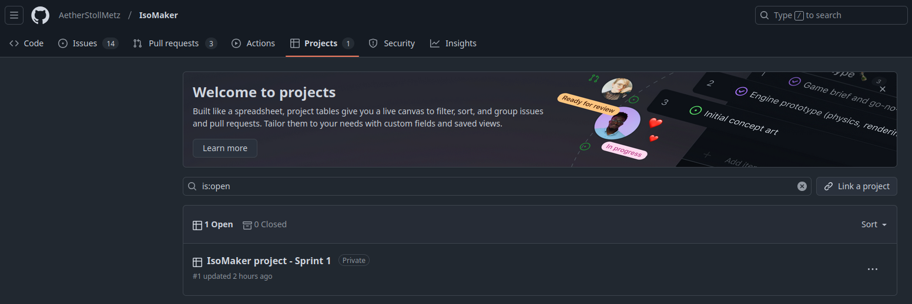
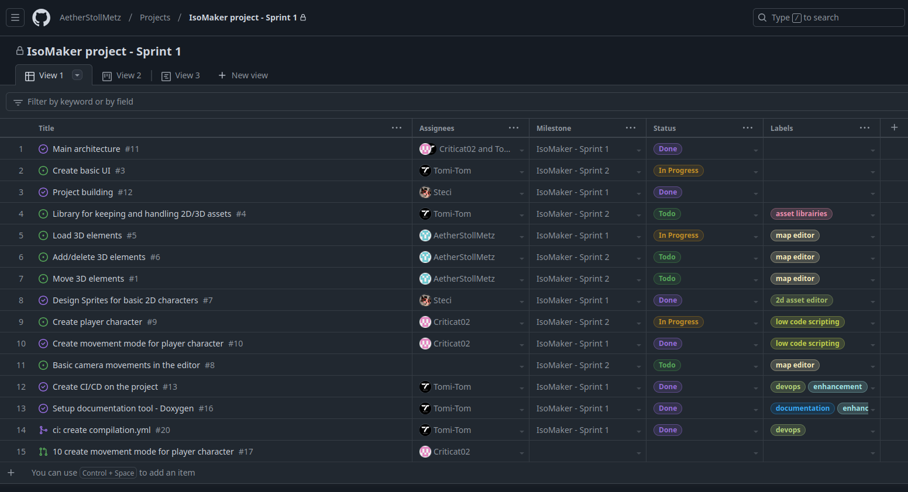
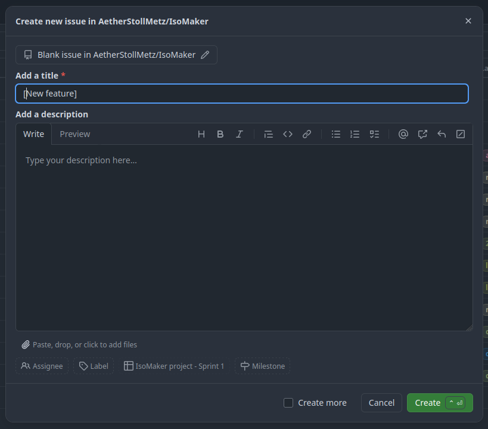
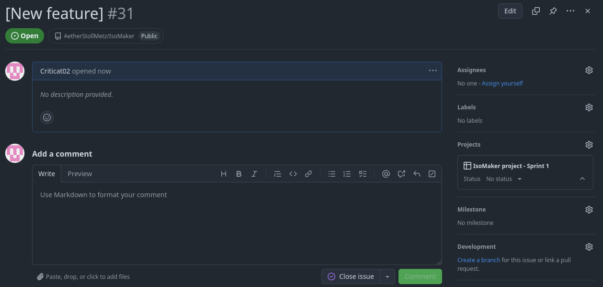
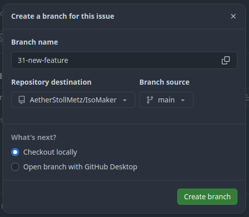
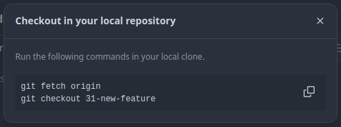

# IsoMaker

IsoMaker est un game engine dédié à la création de jeux isométriques. Il est écrit en C++ et utilise la Raylib pour l’affichage.

## Norme C++

La fondation de la norme de programmation appliquée à ce projet est une adaptation au C++ de la norme de programmation en C d’Epitech. En voici les principes fondamentaux :

### Conventions d'appellation
- Tous les **sous dossiers** et **fichiers** contenus dans les dossiers `/src` et `/includes` devraient être composés d’un seul mot si possible. Ceux ci, ainsi que les noms des **classes** devraint suivre la convention [UpperCamelCase](https://www.techtarget.com/whatis/definition/CamelCase), selon laquelle chaque mot composant le nom doit commencer par une majuscule.
- Les **interfaces** et **classes abstraites** doivent avoir des noms commençant respectivement par un I majuscule ou un A majuscule (ex. `IHandler`, `AHandler`).
- Les **namespaces**, **fonctions** et **variables** devraient suivre la convention [lowerCamelCase](https://www.techtarget.com/whatis/definition/CamelCase), selon laquelle le premier mot composant le nom commence par une minuscule et les suivants par une majuscule (ex. `input::KeyboardHandler::startLoop(bool status)`).

### Arborescence du dossier projet

- Les fichiers `.hpp` contennant des **interfaces**, **implémentations de classes abstraites**, **types spécifiques au projet** et autres choses similaires devraient se trouver dans `/includes/<sous dossier>` (ex. `IHandler.hpp`, `AHandler.hpp` et `Types.hpp` dans `/includes/Input`).
- Les fichiers source `.cpp `nécessaires à la compilation du project devraient se trouver dans `/src/<sous dossier>`, accompagnés de leurs fichiers `.hpp` respectifs (ex. `Keyboard.cpp` et `Keyboard.hpp` dans `/src/Input`).

### Fichiers

- Tous les fichiers devraient commencer par le header Epitech standard, obtenu grâce à l’extension VSCode dédiée.
- Le contenu des fichiers `.hpp` devrait être précédé de `#pragma once`.
- Tous les fichiers devraient se finir par `\n` (retour à la ligne).

### Classes

- Les **spécificateurs d’accès** d’une classe devraient être dasn l’ordre suivant: `public`, `protected`, `private`
- Les **prototypes de fonction** devraient être déclarés avant les **variables**.
- Les **noms des variables** de la classe devraient commencer par un tiret bas (ex. `_position`, `_size`, `_scale`)

## Standard de messages de commit
Tous les commits contribuant à ce projet doivent être accompagnés d’un message de commit adhérant au format suivant, basé sur les standards de [Commits Conventionnel](https://www.conventionalcommits.org/en/v1.0.0/)

```
<type>(<portée>): <description>
```

### Structure

- **`type`**: Décrit l’objectif du commit. Un des types prédéfinis suivants devrait être utilisé:
  - **feat**: Une nouvelle fonctionnalité.
  - **fix**: Une réparation de bug.
  - **refacto**: Changements dans le code qui ne résolvent pas de bug et n’ajoutent pas de fonctionnalitée.
  - **doc**: Changements dans la documentation (ex. modifications du README).
  - **style**: Changements dans la norme du code (ex. format, caractères manquants) qui n’affectent pas de fonctionnalités.
  - **test**: Ajout ou modification de tests.
  - **build**: Maintenance (ex. scripts de compilation, mise à jour des dépendances).

- **`portée`**: Identifie la partie du code affectée. Devrait rester concis, par exemple:
- Le nom d’un module (ex. `graphics`, `input handling`).
- Le nom d’un composant (ex. `button`, `keyboard handler`).
- `*` pour un changement global, impactant de multiples parts.

- **`description`**: Un résumé bref des changements, à l’impératif.
- Devrait commencer par un verbe à l’impératif présent.
- Ne pas commencer par une majuscule ou finir par un point.

#### Examples

1. Ajouter une fonctionalité:
   ```
   feat(input handling): add support for joypad controls
   ```

2. Réparer un bug:
   ```
   fix(graphics): resolve crash on object rendering
   ```

3. Mettre à jour la documentation:
   ```
   doc(readme): improve commit convention examples
   ```

4. Mettre à jour du code:
   ```
   refacto(engine): simplify event loop logic
   ```

5. Mettre à jour des tests:
   ```
   test(graphics): add tests for sprite rendering
   ```

### Pourquoi utiliser ce format?

- **Clarté**: Rend la compréhension du but d’un commit plus facile et rapide
- **Automatisation**: Permet d’utiliser des outils pour générer des notes de version et des journaux de modifications.
- **Uniformité**: Encourage les contributeurs à documenter les changements de façon uniforme


## Comment créer une fonctionnalité et une pull request

### 1. Ouvrir le [Github Project](https://github.com/AetherStollMetz/IsoMaker/projects?query=is%3Aopen) du répertoire



### 2. Ajouter un **item** à la liste



### 3. Ajouter un **nom** et une description



### 4. Cliquer sur le petit bouton **Create a branch**/**Créer une branche**



### 5. Vous voudrez peut être changer la branche source pour autre chose que le main. Sinon, laissez tout tel quel et **créez la branche**.



### 6. Faites un check out local de la branche et créez votre fonctionalité (faites attention à utiliser le [standard de messages de commit](#commit-message-standard))



<br>
<br>
<hr/>
<br>
<br>

# IsoMaker

IsoMaker is a game engine for creating isometric games. It is written in C++ and uses the Raylib for rendering.


## C++ Coding Style

The foundation of the coding style applied to this project is a C++ adapatation of Epitech's C coding style, here are the main rules:

### Naming conventions

- All **subdirectories** and **files** under the `/src` and `/includes` directories should have one word names when possible. These, as well as **classes**, should follow the [UpperCamelCase naming convention](https://www.techtarget.com/whatis/definition/CamelCase), which dictates every compound word in a name is capitalized.
- **Interfaces** and **abstract classes** must have names starting with a capital I and A respectively (e.g., `IHandler`, `AHandler`).
- **Namespaces**, **functions** and **variables** should follow the [lowerCamelCase naming convention](https://www.techtarget.com/whatis/definition/CamelCase), which dictates the first compound word should start with a lowercase, and every compound word after that should be capitalized (e.g., `input::KeyboardHandler::startLoop(bool status)`).


### Project folder architecture

- `.hpp` files containing **interfaces**, **abstract class implementations**, **project specific variable types** and other such things should be found in `/includes/<subdirectory>` (e.g., `IHandler.hpp`, `AHandler.hpp` and `Types.hpp` in `/includes/Input`).
- `.cpp` source files required for building the project should be found in `/src/<subdirectory>`, along with their respective `.hpp` files. (e.g., `Keyboard.cpp` and `Keyboard.hpp` in `/src/Input`).

### Files

- All files should start with the standard Epitech header provided by the official Epitech header extension on VSCode.
- Contents of `.hpp` files should be preceded by `#pragma once`.
- All files should end with `\n` (newline).

### Classes

- A class' **access specifiers** should be written in the following order: `public`, `protected`, `private`.
- **Function prototypes** should be declared before **variables**.
- **Function variable names** should start with an underscore (e.g., `_position`, `_size`, `_scale`).


## Commit Message Standard

All commits contributing to this project must be accompanied by a commit message that adheres to the following format, based on the [Conventional Commits standard](https://www.conventionalcommits.org/en/v1.0.0/):  

```
<type>(<scope>): <description>
```

### Structure

- **`type`**: Describes the purpose of the commit. Use one of the following predefined types:
  - **feat**: A new feature.
  - **fix**: A bug fix.
  - **refacto**: Code changes that neither fix a bug nor add a feature.
  - **doc**: Documentation changes (e.g., README updates).
  - **style**: Code style changes (e.g., formatting, missing semicolons) that do not affect functionality.
  - **test**: Adding or updating tests.
  - **build**: Maintenance tasks (e.g., build scripts, dependency updates).

- **`scope`**: Identifies the specific area of the codebase affected. Keep it concise, such as:
  - A module name (e.g., `graphics`, `input handling`).
  - A component name (e.g., `button`, `keyboard handler`).
  - Use `*` for a global change affecting multiple areas.

- **`description`**: A brief, imperative summary of the change.
  - Start with a verb in the present tense (e.g., `add`, `fix`, `update`).
  - Don't capitalize the first letter or end with a period.

#### Examples

1. Adding a new feature:
   ```
   feat(input handling): add support for joypad controls
   ```

2. Fixing a bug:
   ```
   fix(graphics): resolve crash on object rendering
   ```

3. Updating documentation:
   ```
   doc(readme): improve commit convention examples
   ```

4. Refactoring code:
   ```
   refacto(engine): simplify event loop logic
   ```

5. Updating tests:
   ```
   test(graphics): add tests for sprite rendering
   ```

### Why Use This Format?

- **Clarity**: Makes it easier to understand what a commit does at a glance.
- **Automation**: Supports tools for generating changelogs and release notes.
- **Consistency**: Encourages contributors to document changes uniformly.


## How to add a feature and Pull Request 101

### 1. Access the repository's [Github Project](https://github.com/AetherStollMetz/IsoMaker/projects?query=is%3Aopen)


### 2. Add an **item** to the list


### 3 **Name it** and add a description


### 4. Click on the inexplicably small **Create a branch**


### 5. You may want to make the source branch different from main, otherwise leave everything as is and **create branch**


### 6. Check out locally and code your feature (make sure to respect [the commit message standard](#commit-message-standard) when pushing onto the branch)


## How to add a feature and Pull Request 101

### 1. Access the repository's [Github Project](https://github.com/AetherStollMetz/IsoMaker/projects?query=is%3Aopen)


### 2. Add an **item** to the list


### 3 **Name it** and add a description


### 4. Click on the inexplicably small **Create a branch**


### 5. You may want to make the source branch different from main, otherwise leave everything as is and **create branch**


### 6. Check out locally and code your feature (make sure to respect [the commit message standard](#commit-message-standard) when pushing onto the branch)


## Team ❤️

| [<br><sub>Tom BARITEAU-PETER</sub>](https://github.com/Tomi-Tom) | [<br><sub>Aether Stoll Metz</sub>](https://github.com/AetherStollMetz) | [<br><sub>Léa Guillemard</sub>](https://github.com/steci) | [<br><sub>Aless Tosi</sub>](https://github.com/Criticat02)
|:---:| :---: |:------------------------------------------------------------------------------------------------------------------:| :---: | 